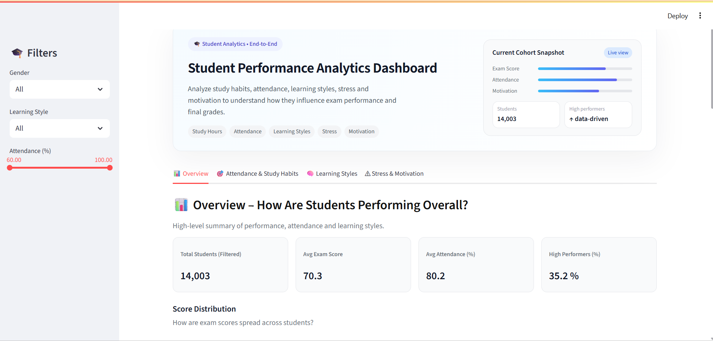

# 🎓 Student Performance Analytics Dashboard
### Analyze Study Habits, Learning Styles, Attendance & Stress Factors to Understand Academic Outcomes

<p align="center">
  
</p>

---

## 📌 Project Overview

The **Student Performance Analytics Dashboard** is an end-to-end analytics project built using **Python, Streamlit, Pandas, Plotly & Power BI**.  

This dashboard enables **educators, institutions, and researchers** to understand how:

- Study hours  
- Attendance  
- Online learning engagement  
- Motivation & assignment discipline  
- Stress levels  
- Learning Style preferences

<p align="center">
  
</p>

➡ **Influence Exam Performance & Final Grades**

This project moves beyond simple visuals — it delivers **actionable insights** aligned with real educational analytics.

---

## ✨ Key Features

| Feature | Description |
|--------|-------------|
| Dataset preprocessing & feature engineering | Automatic cleaning, type handling & analytical buckets |
| Apple-style minimal UI | Clean white interface with clear storytelling visuals |
| Interactive Streamlit dashboard | Filter by gender, attendance range & learning style |
| Study Habit Insights | Study hours impact performance with distribution charts |
| Attendance Threshold Discovery | Identifies cutoff zones where performance drops |
| Learning Style Intelligence | Visual, Auditory, Kinesthetic & Reading/Writing comparison |
| Stress & Motivation Analytics | Behavioral patterns & psychology-based insights |
| Power BI Report Included | Business-facing BI dashboard |

---

## 🧠 Dataset Information

**Source:** Kaggle — *Student Performance and Learning Style*  
**Total Records:** `14,003` Students  
**Total Columns:** `16` Attributes  

| Category | Columns |
|----------|--------|
| Learning & Study | StudyHours, AssignmentCompletion |
| Attendance | Attendance |
| Behavior | Discussions, Extracurricular |
| Engagement | OnlineCourses, EduTech |
| Demographics | Age, Gender |
| Psychology | StressLevel, Motivation |
| Results | ExamScore, FinalGrade |

---

## 🛠 Tech Stack

| Technology | Purpose |
|-----------|---------|
| Python | ETL + Data Processing |
| Pandas | Cleaning + Feature Engineering |
| Streamlit | Web-based Interactive Dashboard |
| Plotly | Visual Analytics |
| Power BI | Additional BI Dashboard |
| GitHub | Repository & Version Control |

---

## 🚀 Run The Streamlit App Locally

```bash
# Clone the repository
git clone https://github.com/bm-bharath/Student-Performance-Analytics-Dashboard.git
```
```bash
# Navigate into project
cd Student-Performance-Analytics-Dashboard
```
```bash
# Install dependencies
pip install -r requirements.txt
```
```bash
# Run Streamlit
cd streamlit_app
streamlit run app.py

```
---

## 🌐 Live Web App (Streamlit Cloud)

🚀 Live Dashboard: 👉 https://YOUR_STREAMLIT_LINK_HERE

---

## 📊 Insights Discovered

🔹 Students studying 10+ hours/week show notable score improvement
🔹 Attendance below 60% strongly correlates with lower performance
🔹 Kinesthetic learners display higher engagement but inconsistent outcome
🔹 Visual learners show more stable performance averages
🔹 High stress does NOT equate to better scores
🔹 Motivation improves results only when matched with study consistency
