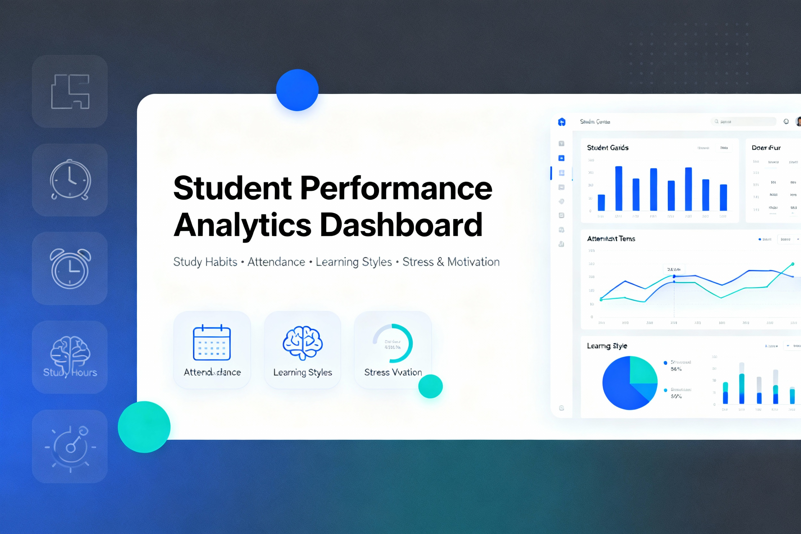

# 🎓 Student Performance Analytics Dashboard
### **Analyze Study Habits, Learning Styles, Attendance & Stress Factors to Understand Academic Outcomes**

---

## 📌 Project Overview

The **Student Performance Analytics Dashboard** is an end-to-end analytics project built using **Python, Streamlit, Pandas, Plotly & Power BI**.  
This dashboard enables **educators, institutions, and researchers** to understand how:

- Study hours  
- Attendance  
- Online engagement  
- Motivation  
- Stress  
- Learning Style  

➡ **Influence Exam Performance & Final Grades**

This project moves beyond simple charts — it provides **actionable insights** based on real educational analytics principles.

---

## ✨ Key Features

| Feature | Description |
|--------|-------------|
| Clean & preprocess large student dataset | Handles missing values, converts types, creates custom analytical buckets |
| Beautiful Minimal UI (Apple-style) | Calm white interface with clear visual storytelling |
| Interactive Streamlit Dashboard | Filters by gender, learning style & attendance %
| Insights on Study Habits | Study hours vs performance visualization |
| Attendance Performance Threshold | Identify the “danger zone” for low attendance |
| Learning Style Impact | Visual, Auditory, Kinesthetic & Reading/Writing insights |
| Stress vs Motivation relationships | Psychology-based analytics |
| Power BI Dashboard Included | Business reporting version |

---

## 🧠 Dataset

**Source:** Kaggle — Student Performance & Learning Style  
**Total Records:** 14,003 Students  
**Attributes:** 16 Columns (Habits + Demographics + Performance)

| Category | Columns |
|----------|--------|
| Learning & Study | StudyHours, AssignmentCompletion |
| Attendance | Attendance |
| Behavior | Discussions, Extracurricular |
| Engagement | OnlineCourses, EduTech |
| Demographics | Age, Gender |
| Psychology | StressLevel, Motivation |
| Results | ExamScore, FinalGrade |

---

## 🛠 Tech Stack

| Tool | Use |
|------|-----|
| Python | ETL + Data Processing |
| Pandas | Cleaning & Feature Engineering |
| Streamlit | Interactive Web Dashboard |
| Plotly | Visualizations |
| Power BI | Business Dashboard |
| GitHub | Version Control |
| CSV | Data Source |

---

## 🚀 How to Run The Streamlit App Locally

--- bash
git clone https://github.com/your-username/Student-Performance-Analytics-Dashboard.git
cd Student-Performance-Analytics-Dashboard
pip install -r requirements.txt
cd streamlit_app
streamlit run app.py

##  🌐 Live Web App (Streamlit Cloud)

🚀 Live Dashboard: 👉 https://YOUR_STREAMLIT_LINK_HERE

---

##  📌 Insights Discovered

🔹 Students studying 10+ hours/week show notable grade improvement
🔹 Attendance below 60% strongly correlates with low scores
🔹 Kinesthetic learners engage more but are inconsistent performers
🔹 Visual learners maintain better average scores
🔹 High stress ≠ high performance (curve collapses after threshold)
🔹 Motivation drives improvement only when matched with study discipline
---
